# Practical-Super-Resolution-with-CNFlow

# Data Generation pipeline

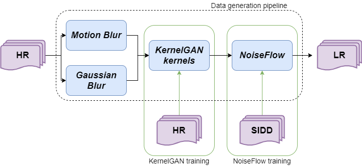 

# Architecture
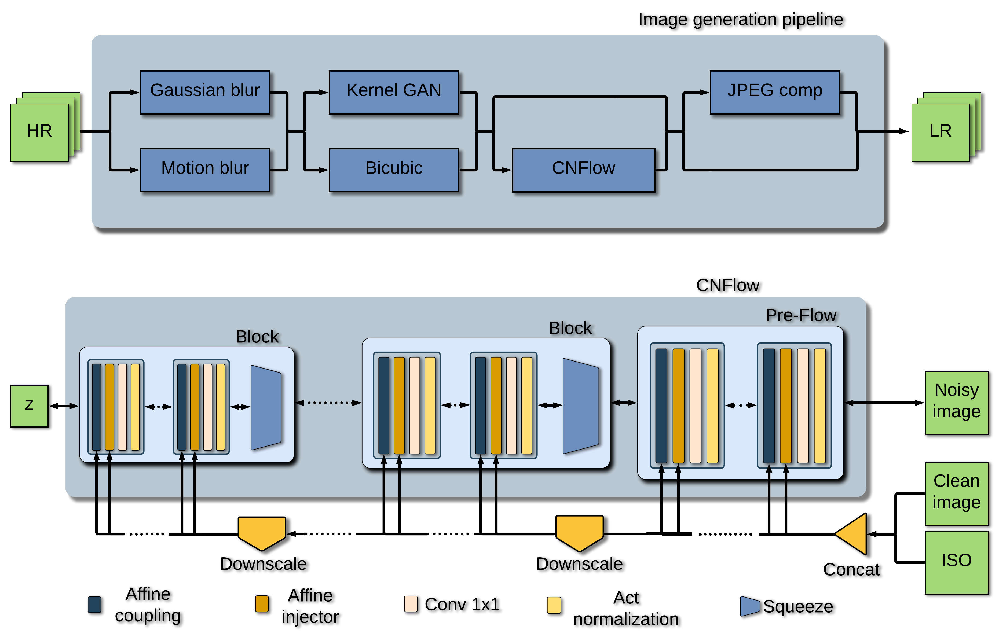 

# Figures

## SR on GoPro images

HR | Bicubic            |  ESRGAN | IKC | RealSRMD 
:-:|:------------------:|:-------:|:---:|:------:
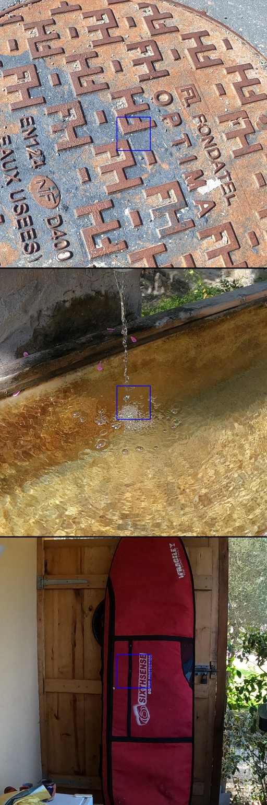  |    | 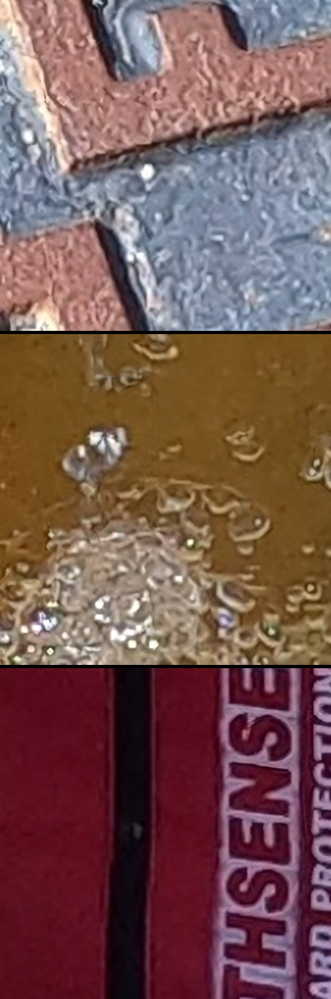  | 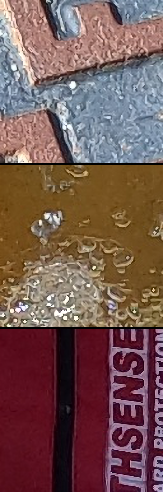  | 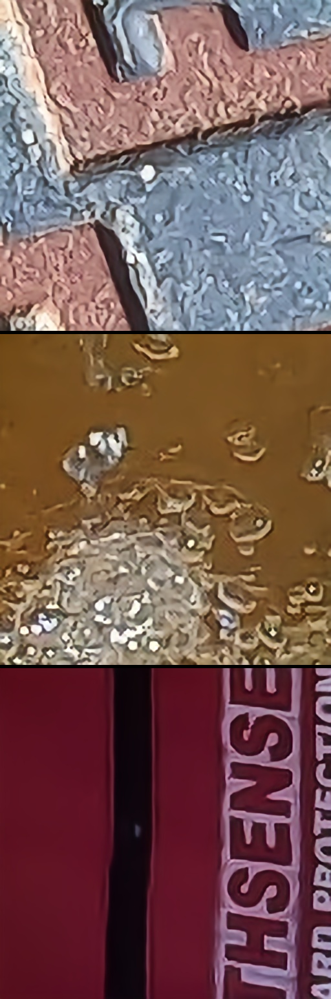  |

## SR on SIDD images

HR | Bicubic            |  ESRGAN | IKC | RealSRMD 
:-:|:------------------:|:-------:|:---:|:------:
  |    |   |   |   |

## Noise generation comparison
Clean | Noisy            |  CNFlow
:----:|:----------------:|:-------:
  |  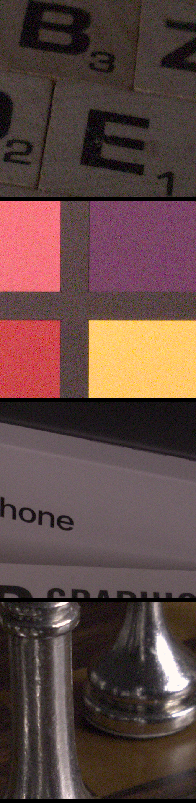   | 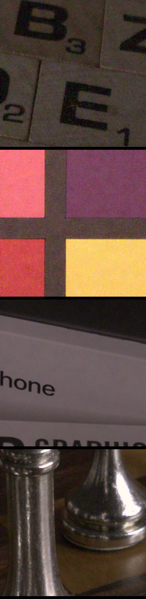 |

## Realworld degradations

 Bicubic            |  ESRGAN | IKC | RealSRMD 
:------------------:|:-------:|:---:|:------:
  |   | 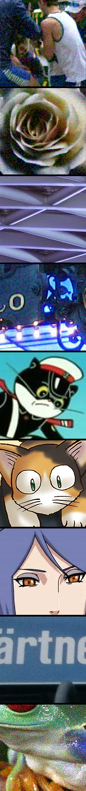  | 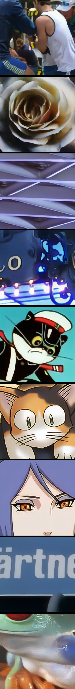  |

## L1 loss vs GAN loss

L1    |  GAN
:------------------:|:-------:
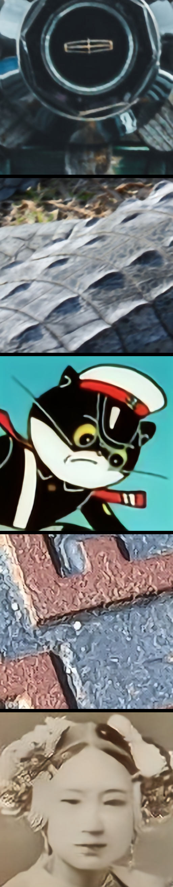  | 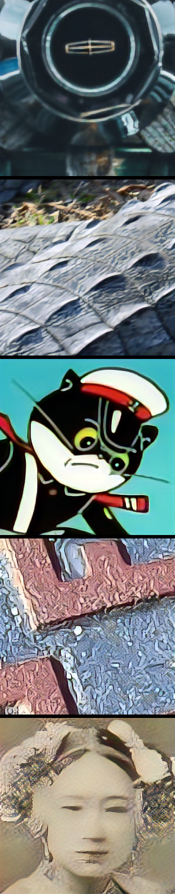  | 

## Ablation study

We study the importance of each block of the data generation pipeline by desactivating KernelGAN downsampling first and by replacing CNFlow by additive Gaussian noise next. We test those trained model on each synthetic dataset and observe that the full pipeline perform the best on each degardations.

|	| Full pipeline | Bicubic Downsampling only | Gaussian noise only
:------------------:|:-------:|:---:|:------:
Type 1)	| 24.79dB | 23.44dB | 22.46dB
Type 2) | 23.25dB | 23.09dB | 23.33dB
Type 3) | 22.5dB | 22.43dB | 20.97dB
